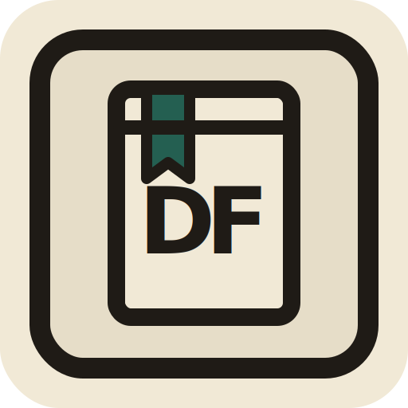

<p align="center">
  
</p>

<h1 align="center">Dona Flora</h1>

<p align="center">
  <strong>Uma biblioteca pessoal local-first, em Markdown, com uma bibliotecária de IA que conversa com o seu acervo.</strong>
</p>

<p align="center">
  <a href="LICENSE"></a>
  <a href="package.json">= 22" src="https://img.shields.io/badge/node-%3E%3D22-1f6f5b.svg" /></a>
  <a href="#como-funciona"></a>
  <a href="#status"></a>
</p>

<p align="center">
  <a href="#comece-em-5-minutos">Comece em 5 minutos</a>
  ·
  <a href="#tour-do-produto">Tour do produto</a>
  ·
  <a href="#como-funciona">Como funciona</a>
  ·
  <a href="#privacidade">Privacidade</a>
  ·
  <a href="#contribuindo">Contribuindo</a>
</p>

---

Dona Flora é para quem ama livros físicos, usa notas em Markdown, quer fugir de planilhas mortas e gostaria de ter uma bibliotecária pessoal que conhece o acervo de verdade.

O app organiza seus livros como arquivos `.md`, funciona bem com Obsidian, guarda contas e conversas localmente e deixa você escolher como a IA responde: Ollama local, OpenAI, Anthropic, OpenRouter ou qualquer endpoint OpenAI-compatible.

> O catálogo é só o começo. A promessa real é uma conversa com memória sobre o que você leu, quer ler, abandonou, destacou e ainda não sabe como conectar.

## Leitura rápida

| Para quem só quer usar                                      | Para quem quer entender o projeto                            |
| ----------------------------------------------------------- | ------------------------------------------------------------ |
| Você escolhe uma pasta de livros em Markdown.               | O Markdown local é a fonte de verdade dos livros.            |
| A Dona Flora cataloga, busca, organiza e conversa com você. | Next.js lê/escreve arquivos e usa SQLite para dados locais.  |
| Dá para começar com Ollama e manter a IA 100% local.        | Providers externos são opcionais e configurados por usuário. |
| Se algo der errado, seus arquivos continuam sendo seus.     | O app evita lock-in: dados legíveis, portáveis e editáveis.  |

Se você não é técnico: pense nela como uma camada bonita e inteligente em cima da sua pasta de livros.

Se você é técnico: pense em um app local-first com Markdown como data layer, SQLite para sessão/preferências e Vercel AI SDK como orquestração de providers.

## Para quem é

| Se você...                                       | A Dona Flora ajuda a...                                       |
| ------------------------------------------------ | ------------------------------------------------------------- |
| Tem livros físicos demais para lembrar de cabeça | transformar a estante em um acervo consultável                |
| Usa Obsidian, VS Code ou Markdown                | manter seus dados em arquivos seus, editáveis fora do app     |
| Quer usar IA sem entregar tudo para a nuvem      | conversar com Ollama local e fallback externo opcional        |
| Cataloga livros raros, antigos ou de sebo        | misturar busca automática com cadastro manual sem fricção     |
| Pede recomendação e recebe resposta genérica     | usar status, notas, highlights e histórico como contexto real |

## Por que existe

Bibliotecas pessoais costumam virar uma destas três coisas:

- uma planilha que ninguém quer abrir;
- uma estante bonita que a memória não acompanha;
- uma pilha de notas soltas que a IA genérica nunca viu.

A Dona Flora tenta outro caminho: seus livros continuam em arquivos simples, legíveis por humanos, mas ganham uma interface boa e uma camada conversacional que entende contexto.

Ela não quer substituir o Obsidian, nem prender seus dados em um banco opaco. Ela quer ser uma casa de leitura em cima de arquivos que continuam seus.

## O que ela faz

### Biblioteca

- Lê e escreve livros como arquivos Markdown.
- Aponta para uma pasta local por usuário, inclusive dentro de um vault Obsidian.
- Busca, filtra, ordena e alterna visualização em grade ou lista.
- Permite edição em massa de status, nota, tags, progresso e campos comuns.
- Preserva metadados ricos: subtítulo, editora, tradutor, série, prioridade, ISBN 10/13, tags e fonte da sinopse.

### Catalogação

- Busca metadados por ISBN ou título.
- Usa Google Books primeiro, Open Library depois e fallback de capa sem scraping.
- Mantém fluxo manual sempre disponível para edições raras ou sem ISBN.
- Gera placeholder local quando a capa não existe.
- Cacheia capas em app data local, sem depender sempre de hotlink externo.

### Conversa

- Chat persistente por usuário.
- A pergunta aparece imediatamente, mesmo se a IA ainda estiver respondendo.
- Conversas ficam em arquivos locais.
- A Dona Flora usa acervo, notas, highlights, preferências e memória da conversa como contexto.
- Sugestões de trilha podem ser salvas e acompanhadas depois.

### Local-first

- Login offline por usuário e senha.
- Multiusuário local.
- SQLite para conta, preferências, segredos opcionais, chats e trilhas.
- Markdown como fonte de verdade dos livros.
- IA local por padrão via Ollama.

## Tour do produto

O produto gira em torno de quatro movimentos:

| Momento                       | O que acontece                                                      | Por que importa                                                        |
| ----------------------------- | ------------------------------------------------------------------- | ---------------------------------------------------------------------- |
| **1. Conectar a biblioteca**  | Você aponta para a pasta onde seus Markdown vivem.                  | O app trabalha em cima dos seus arquivos, não de um banco escondido.   |
| **2. Catalogar sem sofrer**   | Você adiciona por ISBN, título, foto opcional ou formulário manual. | Livro raro, sebo e edição antiga continuam cabendo no fluxo.           |
| **3. Conversar com contexto** | Você pergunta para a Dona Flora usando acervo, notas e highlights.  | A resposta parte da sua biblioteca real, não de recomendação genérica. |
| **4. Salvar trilhas**         | Você guarda caminhos de leitura e acompanha pelo status dos livros. | A trilha não vira checklist paralelo; ela reflete o acervo.            |

```text
Pasta de livros (.md)
        ↓
Snapshot tolerante do Acervo
        ↓
Busca, catálogo, chat e trilhas
        ↓
Você continua podendo editar tudo fora do app
```

Ainda não há screenshots oficiais no README. Isso é deliberado: é melhor publicar sem imagem fake do que expor caminho local, nota privada ou captura improvisada. Quando as imagens entrarem, elas ficam em `docs/screenshots/` com dados sanitizados.

## Como funciona

```text
Next.js App Router
  UI em React
  API routes locais
  Markdown como fonte dos livros
  SQLite local para usuários, preferências e segredos
  Vercel AI SDK para providers
  Ollama/OpenAI/Anthropic/OpenRouter/OpenAI-compatible
```

A regra central é simples:

| Camada                  | Fonte de verdade                                      |
| ----------------------- | ----------------------------------------------------- |
| Livros e notas          | Arquivos `.md` na pasta escolhida pelo usuário        |
| Conversas               | Arquivos locais por usuário                           |
| Trilhas                 | Arquivos locais por usuário                           |
| Conta e preferências    | SQLite local em `DATA_DIR`                            |
| Chaves opcionais de API | SQLite local, criptografadas por `BETTER_AUTH_SECRET` |
| Capas                   | URL original no Markdown + cache local autenticado    |

### Decisões importantes

- **Sem banco para livros:** livros continuam em `.md`, editáveis no Obsidian, VS Code ou qualquer editor.
- **Snapshot tolerante do Acervo:** um arquivo inválido gera diagnóstico, mas não derruba os livros válidos.
- **Dev isolado por padrão:** o app roda em `localhost:3017` e usa cookies próprios para não misturar sessão com outro projeto local.
- **IA por escolha do usuário:** Ollama local é o caminho natural; OpenAI, Anthropic, OpenRouter e endpoints compatíveis são opcionais.
- **Sem scraping:** busca de metadados usa APIs públicas e fallback seguro de capa.

## Formato dos livros

Cada livro é um arquivo Markdown com frontmatter YAML.

```markdown
---
title: O Peso da Glória
author:
  - C. S. Lewis
translator: Paulo Mendes Campos
publisher: Thomas Nelson Brasil
status: quero-ler
rating: 5
tags:
  - ensaios
  - cristianismo
synopsis_source: manual
---

## Notas

Minha anotação livre sobre o livro.

## Highlights

- p.42: "Um trecho importante" - minha nota sobre ele
- "Um destaque sem página também funciona"
```

O frontmatter guarda dados estruturados. O corpo do arquivo continua livre para suas notas.

## Comece em 5 minutos

### Requisitos

- Node.js 22+
- npm
- Opcional: Ollama, se quiser chat 100% local

### Instalar

```bash
git clone https://github.com/resolvicomai/dona-flora.git
cd dona-flora
npm install
cp .env.example .env.local
npm run dev
```

Abra:

```text
http://localhost:3017
```

Por padrão a Dona Flora usa `3017` em desenvolvimento para não disputar sessão/cookies
com outros projetos rodando em `localhost:3000`.

No primeiro acesso, o app abre o cadastro local. Depois que existir pelo menos um usuário, visitantes sem sessão vão para login.

### Testar sem tocar seus dados reais

Use um `DATA_DIR` separado para criar banco, chats e trilhas temporários:

```bash
DATA_DIR=./data-demo npm run dev
```

Quando terminar:

```bash
rm -rf data-demo
```

## Primeiro uso

1. Crie um usuário local.
2. Vá em `Ajustes -> Pasta dos livros`.
3. Escolha a pasta onde seus Markdown vivem.
4. Vá em `Ajustes -> Provedor da Dona Flora`.
5. Teste o Ollama ou configure outro provider.
6. Adicione livros por ISBN, título ou manualmente.
7. Abra o chat e pergunte algo sobre o acervo.
8. Se uma trilha fizer sentido, salve e acompanhe em `Trilhas`.

## Usando com Obsidian

Escolha uma pasta que contenha arquivos `.md`.

Exemplo:

```text
/Users/seu-usuario/Obsidian/livros
```

A pasta do Obsidian continua sendo a fonte de verdade dos livros. Se você editar um arquivo fora da Dona Flora, o app relerá esse Markdown quando montar contexto, busca ou tela.

Para refresh automático em ambiente local:

```bash
DONA_FLORA_LIBRARY_WATCH=1 npm run dev
```

O watcher fica desligado por padrão para evitar comportamento estranho em Docker, serverless ou pastas sincronizadas agressivamente.

## IA e providers

O caminho recomendado é começar por Ollama.

```bash
ollama pull llama3.1:8b
npm run dev
```

Endpoint padrão:

```text
http://127.0.0.1:11434/v1
```

Providers suportados:

| Provider          | Uso recomendado                                  |
| ----------------- | ------------------------------------------------ |
| Ollama            | Chat local, sem chave externa                    |
| OpenAI            | BYOK com modelos OpenAI                          |
| Anthropic         | BYOK com modelos Claude                          |
| OpenRouter        | Fallback externo opcional e modelos variados     |
| OpenAI-compatible | LM Studio, LocalAI, vLLM ou servidor customizado |

Se quiser 100% local, use apenas Ollama ou outro endpoint local compatível.

## Trilhas de leitura

Você pode pedir:

```text
Monte uma trilha com 5 livros para eu entender melhor tecnologia, poder e sociedade.
```

Quando a Dona Flora sugerir uma sequência, você pode salvar a trilha.

Cada trilha tem:

- título editável;
- objetivo editável;
- notas livres;
- exclusão;
- progresso calculado pelo status real dos livros.

Não existe checklist paralelo. Para acompanhar uma trilha, abra os livros e altere o status para `lendo`, `lido` ou outro estado. A trilha reflete isso automaticamente.

## Busca de metadados

Ao adicionar livro, a ordem é:

1. Google Books por ISBN ou título.
2. Open Library por ISBN ou título.
3. Fallback de capa por ISBN-10/ASIN validado por `HEAD`, sem scraping.
4. Cadastro manual.

Isso é intencional. Bibliotecas reais têm livro antigo, edição de clube, sebo, importado, capa rara e obra que API nenhuma conhece.

## Migração de ISBN

O schema aceita `isbn` legado e também `isbn_10` / `isbn_13`.

Dry-run:

```bash
npm run migrate:isbn -- --dir "/caminho/para/livros" --dry-run
```

Aplicar:

```bash
npm run migrate:isbn -- --dir "/caminho/para/livros" --write
```

A migração não roda automaticamente para evitar reescrever acervos sem intenção.

## Docker

```bash
export BETTER_AUTH_SECRET="$(openssl rand -base64 32)"
docker compose up --build
```

O compose usa volume Docker para dados internos. Para conectar uma pasta do Obsidian do host, monte essa pasta no container e configure o caminho equivalente na UI.

## Variáveis de ambiente

Copie `.env.example` para `.env.local`.

| Variável                   | Obrigatória   | Descrição                                                                   |
| -------------------------- | ------------- | --------------------------------------------------------------------------- |
| `BETTER_AUTH_URL`          | Sim           | URL local ou pública do app                                                 |
| `BETTER_AUTH_SECRET`       | Produção: sim | Segredo de sessão e criptografia local. Obrigatório se usar chaves externas |
| `DATA_DIR`                 | Não           | Pasta do SQLite, chats, trilhas e cache                                     |
| `LIBRARY_DIR`              | Não           | Fallback inicial para livros antes de configurar pela UI                    |
| `GOOGLE_BOOKS_API_KEY`     | Não           | Chave opcional para Google Books                                            |
| `DONA_FLORA_LIBRARY_WATCH` | Não           | Use `1` para refresh automático local                                       |

Gere um segredo forte:

```bash
openssl rand -base64 32
```

## Scripts

```bash
npm run dev          # desenvolvimento
npm run dev -- -p 3000 # se quiser forçar outra porta
npm run build        # build de produção
npm run start        # iniciar build de produção
npm run start:local  # iniciar standalone local
npm run lint         # lint
npm run format       # formatar arquivos
npm run format:check # checar formatação
npm test -- --runInBand
npm run migrate:isbn -- --help
```

## Estrutura do projeto

```text
src/
  app/          rotas, páginas e API routes
  components/   UI organizada por domínio
  lib/
    ai/         prompts, providers e preferências da Dona Flora
    api/        Google Books, Open Library e capas externas
    auth/       auth local, SQLite e helpers de sessão
    books/      schema, parser, busca, escrita e cache de livros
    chats/      persistência e serialização das conversas
    covers/     cache local e placeholders de capa
    storage/    contexto de dados por usuário
    trails/     trilhas salvas
docs/
  architecture/ decisões técnicas curtas
```

## Privacidade

Antes de publicar fork, issue ou screenshot, confira:

- não envie `.env.local`;
- não envie `data/`;
- não envie banco SQLite;
- não envie cache de capas;
- não envie sua pasta do Obsidian;
- não coloque chave de API em README, issue ou print.

Chaves opcionais ficam criptografadas localmente com segredo derivado de `BETTER_AUTH_SECRET`. Para qualquer uso real com tokens externos, defina um secret forte.

## Status

Dona Flora está em beta local-first.

Bom para:

- rodar localmente;
- catalogar acervo pessoal;
- usar com Obsidian;
- conversar com IA local;
- experimentar agentes pessoais com dados próprios.

Ainda merece evolução em:

- instalação guiada para pessoas não técnicas;
- importação por foto mais polida;
- sincronização entre dispositivos;
- empacotamento desktop;
- testes com acervos maiores.

## Contribuindo

Contribuições são bem-vindas, principalmente em:

- UX de onboarding;
- acessibilidade;
- metadados de livros brasileiros;
- providers locais;
- formatos de Markdown;
- testes e documentação;
- empacotamento.

Antes de abrir PR:

```bash
npm run lint
npm test -- --runInBand
npm run build
npm run format:check
```

## Quem construiu

Dona Flora é um experimento open source e local-first de [Mauro Marques Filho](https://github.com/resolvicomai) e [Resolvi com AI](https://resolvicomai.app).

O nome conversa com uma Dona Flora real ligada à Biblioteca Rio-Grandense: uma professora que virou bibliotecária por cuidado, memória e presença. A aplicação não tenta representar essa pessoa literalmente; a inspiração é a figura da bibliotecária que conhece o acervo e ajuda o leitor a se orientar.

[Referência sobre Dona Flora e a Biblioteca Rio-Grandense](https://editoratelha.com.br/product/dona-flora-e-a-biblioteca-rio-grandense/)

## Licença

MIT.
